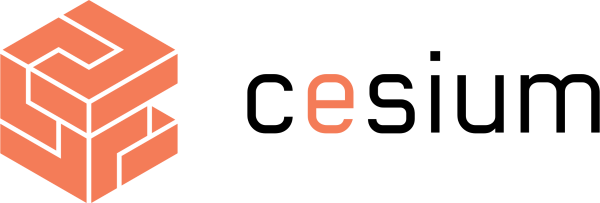

[contributing]: CONTRIBUTING.md
[code_of_conduct]: CODE_OF_CONDUCT.md
[license]: LICENSE.txt

# CeSIUM pelo Mundo

> :world_map: A world map with the places we've been

## :rocket: Getting Started

These instructions will get you a copy of the project up and running on your
local machine for development and testing purposes.

### :inbox_tray: Prerequisites

The following software is required to be installed on your system:

- [Node.js 16.3+](https://nodejs.org/en/download/)

Install all dependencies using `npm install`.

### :hammer: Development

Starting the development server.

```
npm run develop
```

Test your code against common guidelines.

```
npm run test
```

Lint your code.

```
npm run lint
```

Format your code.

```
npm run format
```

### :link: References

You can use these resources to learn more about the technologies this project
uses.

- [Getting Started with React](https://reactjs.org/docs/getting-started.html).
- [Learn Next.js](https://nextjs.org/learn).
- [Leaflet Reference API](https://leafletjs.com/reference.html)
- [Getting Started with React Leaflet](https://react-leaflet.js.org/docs/start-introduction/)

## :handshake: Contributing

Please read [CONTRIBUTING][contributing] and [CODE_OF_CONDUCT][code_of_conduct]
for details on our code of conduct and the process for submitting pull requests
to us.

## :memo: License

This project is licensed under the MIT License - see the [LICENSE][license]
file for details.


